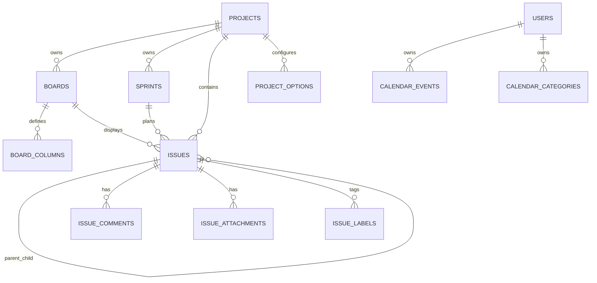

# Agile Task Service Backend Documentation

## 1. Purpose

`agile-task-service` is a Spring Boot microservice for managing agile delivery workflows inspired by Jira Scrum and Kanban usage.

The service owns agile project-management data only:

- Projects
- Scrum and Kanban boards
- Configurable board columns
- Sprints
- Issues, epics, stories, tasks, bugs, and subtasks
- Issue comments
- Issue attachments
- Project-level configurable options for categories, components, and labels
- Personal user calendars

Authentication, authorization, and user profile management are intentionally outside this service. A gateway or user-management service should authenticate users and pass the current user id through the `X-User-Id` header.

## 2. Technology Stack

- Java 21
- Spring Boot 3.5.3
- Spring Web MVC
- Spring Data JPA / Hibernate
- PostgreSQL 16
- Flyway migrations
- Spring Validation
- Spring Actuator
- Springdoc OpenAPI / Swagger UI
- Lombok
- Redis support through an abstraction
- Resource storage support through an abstraction, with Local and Google Cloud Storage implementations

## 3. Local Runtime

### 3.1. Requirements

- Java 21
- Maven
- Docker Desktop or another Docker-compatible runtime
- PostgreSQL container from `docker-compose.yml`

### 3.2. Start Infrastructure

From the project root:

```powershell
docker compose up -d
```

The default PostgreSQL configuration is:

```text
Database: agile_task_service
User: agile_user
Password: agile_password
Host: localhost
Port: 5439
```

Redis is available on port `6379`, but the application defaults to `APP_CACHE_PROVIDER=NONE`.

### 3.3. Run Tests

```powershell
mvn test
```

Tests use the `test` profile and H2 in-memory database.

### 3.4. Run the Backend

```powershell
mvn spring-boot:run
```

Default application URL:

```text
http://localhost:8080
```

Health check:

```text
GET http://localhost:8080/actuator/health
```

Swagger UI:

```text
http://localhost:8080/swagger-ui.html
```

OpenAPI JSON:

```text
http://localhost:8080/v3/api-docs
```

## 4. Configuration

Configuration is centralized in `src/main/resources/application.yml`.

Important environment variables:

| Variable | Default | Description |
| --- | --- | --- |
| `SERVER_PORT` | `8080` | HTTP server port. |
| `DB_URL` | `jdbc:postgresql://localhost:5439/agile_task_service` | PostgreSQL JDBC URL. |
| `DB_USERNAME` | `agile_user` | Database username. |
| `DB_PASSWORD` | `agile_password` | Database password. |
| `APP_LOG_LEVEL` | `INFO` | Application package log level. |
| `APP_CACHE_PROVIDER` | `NONE` | Cache provider. Supported by code: `NONE`, `REDIS`. |
| `APP_CACHE_KEY_PREFIX` | `agile-task-service` | Cache key prefix. |
| `APP_CACHE_DEFAULT_TTL_SECONDS` | `300` | Default cache TTL. |
| `APP_STORAGE_PROVIDER` | `LOCAL` | Resource storage provider. Supported by code: `LOCAL`, `GOOGLE_CLOUD`. |
| `APP_STORAGE_MAX_FILE_SIZE` | `10MB` | Multipart upload limit. |
| `APP_STORAGE_LOCAL_ROOT_PATH` | `./data/uploads` | Local file storage root. |
| `APP_STORAGE_LOCAL_PUBLIC_BASE_URL` | `http://localhost:8080/resources` | Local public base URL. |
| `GCP_STORAGE_BUCKET_NAME` | empty | Google Cloud Storage bucket. |
| `GCP_PROJECT_ID` | empty | Google Cloud project id. |
| `GCP_STORAGE_KEY_PREFIX` | `agile-task-service` | Google Cloud object key prefix. |
| `GCP_STORAGE_PUBLIC_BASE_URL` | empty | Optional public URL base for GCS objects. |

Google Cloud Storage is fail-safe. If `APP_STORAGE_PROVIDER=GOOGLE_CLOUD` but the required bucket/project credentials are not ready, attachment metadata can still be saved without crashing the issue workflow. The returned attachment can have a `null` `publicUrl` until storage is configured.

## 5. Request Conventions

### 5.1. User Context

Endpoints that create, archive, or access user-owned data require:

```http
X-User-Id: 11111111-1111-1111-1111-111111111111
```

This id is not validated against a user table in this service. It is treated as an external identity owned by the future user-management microservice.

### 5.2. Pagination

Search endpoints use Spring pagination:

```text
?page=0&size=20&sort=createdAt,desc
```

### 5.3. Soft Delete

Entities inherit from `BaseEntity`, which includes:

- `id`
- `createdAt`
- `updatedAt`
- `deletedAt`
- `deletedByUserId`

Delete endpoints archive records by setting `deletedAt` and `deletedByUserId`. Normal queries filter archived records out.

### 5.4. Standard Error Format

Errors return `ApiErrorResponse`:

```json
{
  "timestamp": "2026-07-02T15:00:00Z",
  "status": 400,
  "code": "VALIDATION_ERROR",
  "message": "Request validation failed.",
  "path": "/api/v1/issues",
  "fieldErrors": [
    {
      "field": "title",
      "message": "must not be blank"
    }
  ]
}
```

Common error codes:

- `VALIDATION_ERROR`
- `BAD_REQUEST`
- `BUSINESS_RULE_VIOLATION`
- `RESOURCE_NOT_FOUND`
- `CONFLICT`
- `PAYLOAD_TOO_LARGE`
- `STATIC_RESOURCE_NOT_FOUND`
- `INTERNAL_SERVER_ERROR`

## 6. Domain Model

### 6.1. Main Relationships



`USERS` is external. This service stores only user ids.

### 6.2. Enums

| Enum | Values |
| --- | --- |
| `BoardType` | `SCRUM`, `KANBAN` |
| `IssueType` | `EPIC`, `STORY`, `TASK`, `BUG`, `SUBTASK` |
| `IssuePriority` | `LOW`, `MEDIUM`, `HIGH`, `CRITICAL` |
| `SprintStatus` | `PLANNED`, `ACTIVE`, `COMPLETED` |
| `ProjectOptionType` | `ISSUE_CATEGORY`, `ISSUE_COMPONENT`, `ISSUE_LABEL` |
| `CalendarEventStatus` | `PLANNED`, `DONE`, `CANCELED` |

## 7. Module Behavior

### 7.1. Projects

Projects group all agile work.

Rules:

- Project keys must match `^[A-Z][A-Z0-9]{1,9}$`.
- Project keys are unique.
- Projects are soft-deleted.

Endpoints:

| Method | Path | Description |
| --- | --- | --- |
| `POST` | `/api/v1/projects` | Create a project. Requires `X-User-Id`. |
| `GET` | `/api/v1/projects/{id}` | Get project by id. |
| `GET` | `/api/v1/projects` | Search projects by optional `text`. |
| `PATCH` | `/api/v1/projects/{id}` | Update project name and description. |
| `DELETE` | `/api/v1/projects/{id}` | Archive project. Requires `X-User-Id`. |

Create request:

```json
{
  "key": "SCRUM",
  "name": "My Software Team",
  "description": "Internal agile delivery project."
}
```

### 7.2. Boards and Columns

Boards belong to a project and can be `SCRUM` or `KANBAN`. Columns define the workflow status keys that issues can use.

Rules:

- A board must be created with at least one column.
- Column `statusKey` values are normalized to uppercase.
- Status keys must be unique per board.
- Issue status must match an active board column.
- When a column status key changes, existing issues are migrated to the new status key.
- A board must keep at least one active column.
- A column with issues can only be archived if a replacement status key is provided.

Endpoints:

| Method | Path | Description |
| --- | --- | --- |
| `POST` | `/api/v1/boards` | Create board with initial columns. |
| `GET` | `/api/v1/boards/{id}` | Get board with ordered columns. |
| `GET` | `/api/v1/boards?projectId={projectId}` | List boards by project. |
| `PATCH` | `/api/v1/boards/{id}` | Update board name. |
| `DELETE` | `/api/v1/boards/{id}` | Archive board. Requires `X-User-Id`. |
| `POST` | `/api/v1/boards/{boardId}/columns` | Add a column. |
| `GET` | `/api/v1/boards/{boardId}/columns` | List columns. |
| `PATCH` | `/api/v1/boards/{boardId}/columns/{columnId}` | Update a column. |
| `POST` | `/api/v1/boards/{boardId}/columns/reorder` | Reorder columns. |
| `DELETE` | `/api/v1/boards/{boardId}/columns/{columnId}` | Archive a column. Requires `X-User-Id`. |

Create board request:

```json
{
  "projectId": "PROJECT_UUID",
  "name": "Team Scrum Board",
  "type": "SCRUM",
  "columns": [
    {
      "name": "To Do",
      "statusKey": "TODO",
      "position": 0,
      "wipLimit": null
    },
    {
      "name": "In Progress",
      "statusKey": "IN_PROGRESS",
      "position": 1,
      "wipLimit": 5
    },
    {
      "name": "Done",
      "statusKey": "DONE",
      "position": 2,
      "wipLimit": null
    }
  ]
}
```

Add column request:

```json
{
  "name": "Testing",
  "statusKey": "TESTING",
  "position": 2,
  "wipLimit": 4
}
```

Reorder columns request:

```json
{
  "columns": [
    {
      "id": "COLUMN_UUID",
      "position": 0
    }
  ]
}
```

Archive column request when the column still has issues:

```json
{
  "replacementStatusKey": "DONE"
}
```

### 7.3. Project Options

Project options let users configure known values without hardcoding everything as Java enums.

Supported option families:

- `ISSUE_CATEGORY`
- `ISSUE_COMPONENT`
- `ISSUE_LABEL`

Rules:

- Keys are normalized to uppercase.
- Keys must match `^[A-Z0-9][A-Z0-9_\-]{0,79}$`.
- Keys are unique per project and option type.
- Issue categories and components must already exist as project options.
- Issue labels are auto-created when missing, which makes lightweight tagging easier for the UI.

Endpoints:

| Method | Path | Description |
| --- | --- | --- |
| `POST` | `/api/v1/projects/{projectId}/options` | Create option. |
| `GET` | `/api/v1/projects/{projectId}/options` | List options, optional `type` filter. |
| `PATCH` | `/api/v1/projects/{projectId}/options/{optionId}` | Update option. |
| `DELETE` | `/api/v1/projects/{projectId}/options/{optionId}` | Archive option. Requires `X-User-Id`. |

Create option request:

```json
{
  "type": "ISSUE_CATEGORY",
  "key": "BACKEND",
  "name": "Backend",
  "description": "Backend service work.",
  "color": "#579DFF",
  "position": 0
}
```

### 7.4. Sprints

Sprints are Scrum planning containers that belong to a project.

Rules:

- End date cannot be before start date.
- New sprints start as `PLANNED`.
- Only `PLANNED` sprints can be started.
- A project can have only one `ACTIVE` sprint.
- Only `ACTIVE` sprints can be completed.
- Completed sprints cannot be updated.
- Active sprints cannot be archived.

Endpoints:

| Method | Path | Description |
| --- | --- | --- |
| `POST` | `/api/v1/sprints` | Create sprint. |
| `GET` | `/api/v1/sprints/{id}` | Get sprint. |
| `GET` | `/api/v1/sprints?projectId={projectId}` | List sprints by project. |
| `PATCH` | `/api/v1/sprints/{id}` | Update planned or active sprint. |
| `POST` | `/api/v1/sprints/{id}/start` | Start sprint. |
| `POST` | `/api/v1/sprints/{id}/complete` | Complete sprint. |
| `DELETE` | `/api/v1/sprints/{id}` | Archive non-active sprint. Requires `X-User-Id`. |

Create sprint request:

```json
{
  "projectId": "PROJECT_UUID",
  "name": "Sprint 2026.07.1",
  "goal": "Ship the first board workflow.",
  "startDate": "2026-07-01",
  "endDate": "2026-07-14"
}
```

### 7.5. Issues

Issues are agile work items. They can represent epics, stories, tasks, bugs, or subtasks.

Rules:

- The project, board, sprint, and parent issue must belong to the same project.
- The issue status must match an active board column status key.
- Epics cannot have a parent issue.
- Subtasks must have a parent issue.
- Subtasks cannot be parent issues.
- Categories and components must exist as project options.
- Labels are normalized and auto-created as project label options when missing.
- The reporter is resolved from `X-User-Id`.
- Delete is soft-delete.

Endpoints:

| Method | Path | Description |
| --- | --- | --- |
| `POST` | `/api/v1/issues` | Create issue. Requires `X-User-Id`. |
| `GET` | `/api/v1/issues/{id}` | Get issue. |
| `GET` | `/api/v1/issues` | Search issues. |
| `PATCH` | `/api/v1/issues/{id}` | Update issue. |
| `PATCH` | `/api/v1/issues/{id}/assignment` | Assign or unassign issue. |
| `POST` | `/api/v1/issues/{id}/move` | Move issue between statuses, sprints, or positions. |
| `DELETE` | `/api/v1/issues/{id}` | Archive issue. Requires `X-User-Id`. |
| `POST` | `/api/v1/issues/{id}/comments` | Add comment. Requires `X-User-Id`. |
| `GET` | `/api/v1/issues/{id}/comments` | List comments. |
| `DELETE` | `/api/v1/issues/{id}/comments/{commentId}` | Archive comment. Requires `X-User-Id`. |
| `POST` | `/api/v1/issues/{id}/attachments` | Upload attachment. Requires `X-User-Id`. |
| `GET` | `/api/v1/issues/{id}/attachments` | List attachments. |
| `DELETE` | `/api/v1/issues/{id}/attachments/{attachmentId}` | Archive attachment metadata. Requires `X-User-Id`. |

Issue search filters:

```text
projectId
boardId
sprintId
assigneeUserId
reporterUserId
type
priority
status
categoryKey
componentKey
labelKey
unassigned
backlogOnly
text
dueFrom
dueTo
page
size
sort
```

Create issue request:

```json
{
  "projectId": "PROJECT_UUID",
  "boardId": "BOARD_UUID",
  "sprintId": null,
  "parentIssueId": null,
  "title": "Create board column API",
  "description": "The frontend needs an endpoint to configure board columns.",
  "type": "STORY",
  "priority": "HIGH",
  "status": "TODO",
  "categoryKey": "BACKEND",
  "componentKey": "API",
  "labels": ["JIRA_CLONE", "BOARD"],
  "assigneeUserId": "22222222-2222-2222-2222-222222222222",
  "storyPoints": 5,
  "dueDate": "2026-07-10",
  "position": 0
}
```

Move issue request:

```json
{
  "boardId": "BOARD_UUID",
  "status": "IN_PROGRESS",
  "sprintId": "SPRINT_UUID",
  "position": 1
}
```

Assign issue request:

```json
{
  "assigneeUserId": "22222222-2222-2222-2222-222222222222"
}
```

Unassign issue request:

```json
{
  "assigneeUserId": null
}
```

Create comment request:

```json
{
  "body": "This is ready for QA."
}
```

Upload attachment:

```text
POST /api/v1/issues/{id}/attachments
Content-Type: multipart/form-data
X-User-Id: USER_UUID
file: binary file field
```

### 7.6. Personal Calendar

The calendar module is user-owned. Each user sees only their own calendar events and categories based on `X-User-Id`.

Use cases:

- Personal meeting reminders
- Work notes for a specific date
- Personal planning for QA, developers, testers, or infrastructure engineers
- Filtering by category, status, date range, or text

Rules:

- Events belong to exactly one user id.
- Categories belong to exactly one user id.
- `endAt` cannot be before `startAt`.
- `reminderAt` cannot be after `startAt`.
- If no timezone is provided, `UTC` is used.
- Calendar category keys are normalized to uppercase.
- If an event references a missing category key, that category is created automatically for the user.
- Delete is soft-delete.
- No file attachments are supported for calendar events.

Endpoints:

| Method | Path | Description |
| --- | --- | --- |
| `POST` | `/api/v1/calendar/events` | Create personal event. Requires `X-User-Id`. |
| `GET` | `/api/v1/calendar/events/{eventId}` | Get one owned event. Requires `X-User-Id`. |
| `GET` | `/api/v1/calendar/events` | Search owned events. Requires `X-User-Id`. |
| `GET` | `/api/v1/calendar/dates/{date}/events` | List events overlapping a local date. Requires `X-User-Id`. |
| `PATCH` | `/api/v1/calendar/events/{eventId}` | Update owned event. Requires `X-User-Id`. |
| `DELETE` | `/api/v1/calendar/events/{eventId}` | Archive owned event. Requires `X-User-Id`. |
| `POST` | `/api/v1/calendar/categories` | Create personal category. Requires `X-User-Id`. |
| `GET` | `/api/v1/calendar/categories` | List personal categories. Requires `X-User-Id`. |
| `PATCH` | `/api/v1/calendar/categories/{categoryId}` | Update personal category. Requires `X-User-Id`. |
| `DELETE` | `/api/v1/calendar/categories/{categoryId}` | Archive personal category. Requires `X-User-Id`. |

Calendar event search filters:

```text
from
to
categoryKey
status
text
page
size
sort
```

Create calendar category request:

```json
{
  "key": "MEETING",
  "name": "Meeting",
  "description": "Team meetings and ceremonies.",
  "color": "#579DFF",
  "position": 0
}
```

Create calendar event request:

```json
{
  "title": "QA planning meeting",
  "notes": "Review board blockers and release risks.",
  "location": "Google Meet",
  "startAt": "2026-07-06T14:00:00Z",
  "endAt": "2026-07-06T15:00:00Z",
  "allDay": false,
  "timeZone": "America/Santo_Domingo",
  "categoryKey": "MEETING",
  "color": "#579DFF",
  "status": "PLANNED",
  "reminderAt": "2026-07-06T13:45:00Z"
}
```

List events for a local date:

```text
GET /api/v1/calendar/dates/2026-07-06/events?timeZone=America/Santo_Domingo
```

## 8. Recommended First Manual Test Flow

Use the same `X-User-Id` on all protected requests:

```http
X-User-Id: 11111111-1111-1111-1111-111111111111
```

### Step 1: Create a Project

```http
POST /api/v1/projects
```

```json
{
  "key": "SCRUM",
  "name": "My Software Team",
  "description": "Internal agile delivery project."
}
```

### Step 2: Create Project Options

Create a category:

```http
POST /api/v1/projects/{projectId}/options
```

```json
{
  "type": "ISSUE_CATEGORY",
  "key": "BACKEND",
  "name": "Backend",
  "description": "Backend work",
  "color": "#579DFF",
  "position": 0
}
```

Create a component:

```json
{
  "type": "ISSUE_COMPONENT",
  "key": "API",
  "name": "API",
  "description": "HTTP API work",
  "color": "#85B8FF",
  "position": 0
}
```

### Step 3: Create a Board

```http
POST /api/v1/boards
```

```json
{
  "projectId": "PROJECT_UUID",
  "name": "Main Scrum Board",
  "type": "SCRUM",
  "columns": [
    {
      "name": "To Do",
      "statusKey": "TODO",
      "position": 0,
      "wipLimit": null
    },
    {
      "name": "In Progress",
      "statusKey": "IN_PROGRESS",
      "position": 1,
      "wipLimit": 5
    },
    {
      "name": "Done",
      "statusKey": "DONE",
      "position": 2,
      "wipLimit": null
    }
  ]
}
```

### Step 4: Create a Sprint

```http
POST /api/v1/sprints
```

```json
{
  "projectId": "PROJECT_UUID",
  "name": "Sprint 1",
  "goal": "Validate the core workflow.",
  "startDate": "2026-07-06",
  "endDate": "2026-07-19"
}
```

### Step 5: Create an Issue

```http
POST /api/v1/issues
```

```json
{
  "projectId": "PROJECT_UUID",
  "boardId": "BOARD_UUID",
  "sprintId": "SPRINT_UUID",
  "parentIssueId": null,
  "title": "Build the first board workflow",
  "description": "Create an issue and move it through the board.",
  "type": "STORY",
  "priority": "HIGH",
  "status": "TODO",
  "categoryKey": "BACKEND",
  "componentKey": "API",
  "labels": ["BOARD"],
  "assigneeUserId": "22222222-2222-2222-2222-222222222222",
  "storyPoints": 5,
  "dueDate": "2026-07-15",
  "position": 0
}
```

### Step 6: Move the Issue

```http
POST /api/v1/issues/{issueId}/move
```

```json
{
  "boardId": "BOARD_UUID",
  "status": "IN_PROGRESS",
  "sprintId": "SPRINT_UUID",
  "position": 0
}
```

### Step 7: Search Board Issues

```text
GET /api/v1/issues?boardId=BOARD_UUID&status=IN_PROGRESS&size=50&sort=position,asc
```

### Step 8: Create Calendar Data

```http
POST /api/v1/calendar/events
```

```json
{
  "title": "Sprint planning",
  "notes": "Review backlog candidates.",
  "location": "Google Meet",
  "startAt": "2026-07-06T14:00:00Z",
  "endAt": "2026-07-06T15:00:00Z",
  "allDay": false,
  "timeZone": "America/Santo_Domingo",
  "categoryKey": "MEETING",
  "color": "#579DFF",
  "status": "PLANNED",
  "reminderAt": "2026-07-06T13:45:00Z"
}
```

## 9. Frontend Integration Notes

The frontend should treat this service as the source of truth for all agile data except users.

Recommended UI boot sequence:

1. Call `GET /api/v1/projects?size=20&sort=createdAt,desc`.
2. If no project exists, show a setup flow and create the first project.
3. After project creation, create default project options.
4. Create a board with default columns.
5. Load boards through `GET /api/v1/boards?projectId={projectId}`.
6. Load columns through `GET /api/v1/boards/{boardId}/columns`.
7. Load board cards through `GET /api/v1/issues?boardId={boardId}&size=100&sort=position,asc`.
8. Load backlog through `GET /api/v1/issues?projectId={projectId}&backlogOnly=true&size=100&sort=position,asc`.
9. Load sprints through `GET /api/v1/sprints?projectId={projectId}`.
10. Load project option selectors through `GET /api/v1/projects/{projectId}/options`.

For user display, the frontend should map `assigneeUserId`, `reporterUserId`, `createdByUserId`, and calendar `ownerUserId` to its mocked or future user-management data.

## 10. Empty Database Behavior

The backend supports empty database startup.

Expected behavior:

- Project search returns an empty page.
- Board list requires a valid project id; if no project exists, create a project first.
- Calendar searches return empty pages/lists for a valid `X-User-Id`.
- Issue searches return empty pages.
- Swagger and actuator health work without domain data.

The frontend should not hardcode seed data. It should detect empty API responses and guide the user through setup.

## 11. Storage and Attachments

Attachments use the `ResourceStorageService` port:

```text
ResourceStorageService
  LocalResourceStorageService
  GoogleCloudStorageResourceStorageService
```

This keeps issue attachment logic independent from the storage technology.

Attachment metadata is stored in `issue_attachments`:

- issue id
- uploaded user id
- file name
- content type
- size
- storage key
- public URL

The upload limit is configured through:

```text
APP_STORAGE_MAX_FILE_SIZE
```

Default:

```text
10MB
```

## 12. Cache Abstraction

Cache access goes through:

```text
InMemoryKeyValueStoreService
  NoOpInMemoryKeyValueStoreService
  RedisInMemoryKeyValueStoreService
```

The application can run without Redis by using `APP_CACHE_PROVIDER=NONE`.

Redis can be enabled by setting:

```text
APP_CACHE_PROVIDER=REDIS
REDIS_HOST=localhost
REDIS_PORT=6379
```

## 13. Database Migrations

Flyway migrations live in:

```text
src/main/resources/db/migration
```

Current migrations:

- `V1__init_agile_task_service.sql`
- `V2__jira_like_flexibility.sql`
- `V3__personal_calendar.sql`

JPA uses:

```yaml
spring.jpa.hibernate.ddl-auto: validate
```

That means schema changes must be made through Flyway migrations, not by Hibernate auto-generation.

## 14. Operational Endpoints

Actuator endpoints are exposed under:

```text
/actuator
```

Enabled:

- `/actuator/health`
- `/actuator/info`
- `/actuator/metrics`
- `/actuator/prometheus`

## 15. Design Principles Used

- Keep the service independent from user-management.
- Store external users as UUIDs only.
- Use soft-delete for historical safety.
- Use enums for stable system concepts.
- Use configurable project options for user-defined categories, components, and labels.
- Keep storage behind an application port.
- Keep cache behind an application port.
- Keep OpenAPI documentation close to controllers and DTOs.
- Keep optional infrastructure fail-safe where possible.
- Do not require seed data for the backend to start or respond correctly.

